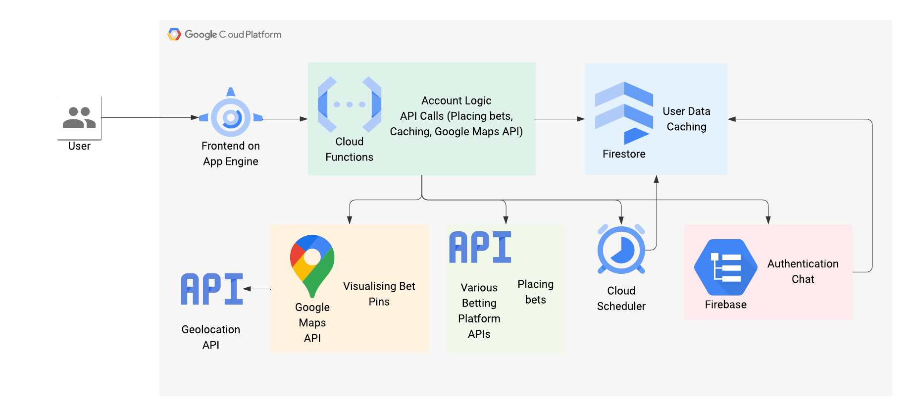
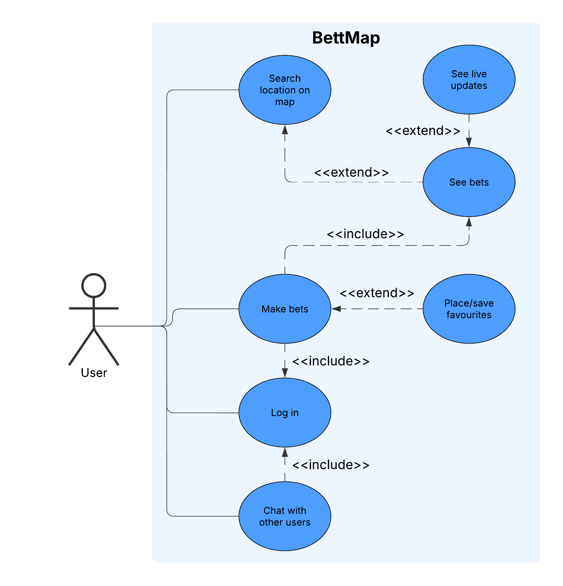

# BettMap – Vizualizare Globală a Pariurilor în Timp Real

## 1. Studiu de Caz – Context Național și Internațional

Într-o lume tot mai conectată digital, piețele de predicții și platformele de betting descentralizate (ex: [Polymarket](https://polymarket.com/)) capătă o importanță crescută. La nivel internațional, aplicațiile care combină vizualizarea geografică cu predicțiile live sunt extrem de rare. La nivel național, România nu dispune de o astfel de platformă care să centralizeze pariurile live într-un mod interactiv și vizual, motiv pentru care aplicația **BettMap** vine să umple acest gol.

## 2. Soluții Existente – Arhitectură, Tehnologii, Marketing

| Platformă     | Arhitectură            | Tehnologii principale | Strategii de marketing          |
|---------------|------------------------|------------------------|---------------------------------|
| Polymarket    | Web3, Oracle feeds     | Ethereum, React        | Comunități crypto, Twitter      |
| Google Maps   | Client-Server          | Maps API, JS           | Open APIs, Integrare în aplicații |
| Bet365        | Proprietară, scalabilă | Java, C++, React       | Sponsorizări, SEO, Reclame TV   |

Aceste soluții inspiră **BettMap** să combine date descentralizate cu o interfață modernă, map-based, oferind un mix între actualizare în timp real și interactivitate vizuală.

## 3. Tehnologii Propuse

| Tehnologie             | Rol                                           | Motivare                            |
|------------------------|-----------------------------------------------|--------------------------------------|
| React.js               | Frontend SPA                                  | Rapid, interactiv, component-based   |
| Google Maps JS API     | Hartă și pinuri live                          | Precizie, documentație solidă        |
| Firebase (Google Cloud)| Autentificare, Firestore, Cloud Functions     | Scalabilitate, integrare rapidă      |
| Swagger + OpenAPI      | Definirea și testarea API-urilor              | Standard industrial, compatibilitate |
| Node.js + Express      | Backend REST                                   | Rapid development, middleware power  |
| WebSocket / Firebase RT| Chat live                                     | Realtime, low-latency                |

## 4. Business Canvas

| Element         | Descriere                                                                 |
|-----------------|--------------------------------------------------------------------------|
| Problemă        | Lipsa unei vizualizări globale interactive pentru pariuri în timp real. |
| Soluție         | Mapă globală cu pinuri live pentru pariuri, filtrabilă pe regiuni/țări.  |
| Segmente        | Fani sport, utilizatori Polymarket, pariori casual.                     |
| Canale          | Web app, Google Ads, Reddit, Discord.                                   |
| Venituri        | Comisioane micro pe top-up-uri, reclame targetate.                      |
| Costuri         | Cloud, APIs, dezvoltare software.                                       |
| Avantaj         | UX modern, map-based, integrare betting live + comunitate               |
| Activități      | Colectare date, dezvoltare API, marketing                               |
| Parteneri       | Google Cloud, Polymarket, Discord communities                           |

## 5. Arhitectură Soluție
```
[User - React App]
     |
     |---> Login/Register (Firebase Auth)
     |---> Vizualizare hartă + marker bets (Maps JS API)
     |---> Favorite / Chat / Search (Firestore + Functions)
     |---> Top-up (Stripe/Cloud Function)
     |---> Upload media (Firebase Storage)
```



- Frontend comunică cu backend prin API REST
- Backend se ocupă de logica de cont, plasare/salvare favorite, caching date pariuri
- Google Maps API generează vizualizarea pinurilor
- Firebase gestionează utilizatorii, chat, evenimente

## 6. Use-Case Diagram



- Actor principal: utilizator
- Funcționalități secundare: socializare, preferințe, monetizare

## 7. API-uri și Fluxuri (OpenAPI / SwaggerHub)

Exemplu SwaggerHub pentru un endpoint:

```yaml
openapi: 3.0.0
info:
  title: BettMap API
  version: 1.0.0
  description: API pentru gestionarea pariurilor live, favorite și locații globale.

servers:
  - url: https://api.bettmap.com/v1

paths:
  /bets:
    get:
      summary: Return all live bets
      responses:
        '200':
          description: A list of live bets
          content:
            application/json:
              schema:
                type: array
                items:
                  $ref: '#/components/schemas/Bet'
    post:
      summary: Create a new live bet
      requestBody:
        required: true
        content:
          application/json:
            schema:
              $ref: '#/components/schemas/NewBet'
      responses:
        '201':
          description: Bet created successfully

  /bets/{id}:
    get:
      summary: Get a specific bet by ID
      parameters:
        - in: path
          name: id
          required: true
          schema:
            type: string
      responses:
        '200':
          description: A single bet
          content:
            application/json:
              schema:
                $ref: '#/components/schemas/Bet'
        '404':
          description: Bet not found

  /favorites:
    get:
      summary: Get all favorite bets for the authenticated user
      responses:
        '200':
          description: List of favorite bets
          content:
            application/json:
              schema:
                type: array
                items:
                  $ref: '#/components/schemas/Bet'
    post:
      summary: Add a bet to favorites
      requestBody:
        required: true
        content:
          application/json:
            schema:
              type: object
              required:
                - betId
              properties:
                betId:
                  type: string
      responses:
        '200':
          description: Bet added to favorites

  /locations:
    get:
      summary: Get list of countries/regions with active bets
      responses:
        '200':
          description: Country list with bet counts
          content:
            application/json:
              schema:
                type: array
                items:
                  $ref: '#/components/schemas/LocationInfo'

components:
  schemas:
    Bet:
      type: object
      properties:
        id:
          type: string
        title:
          type: string
        country:
          type: string
        lat:
          type: number
        lng:
          type: number
        market:
          type: string
        createdAt:
          type: string
          format: date-time

    NewBet:
      type: object
      required: [title, country, lat, lng, market]
      properties:
        title:
          type: string
        country:
          type: string
        lat:
          type: number
        lng:
          type: number
        market:
          type: string

    LocationInfo:
      type: object
      properties:
        country:
          type: string
        totalBets:
          type: integer
        lat:
          type: number
        lng:
          type: number

