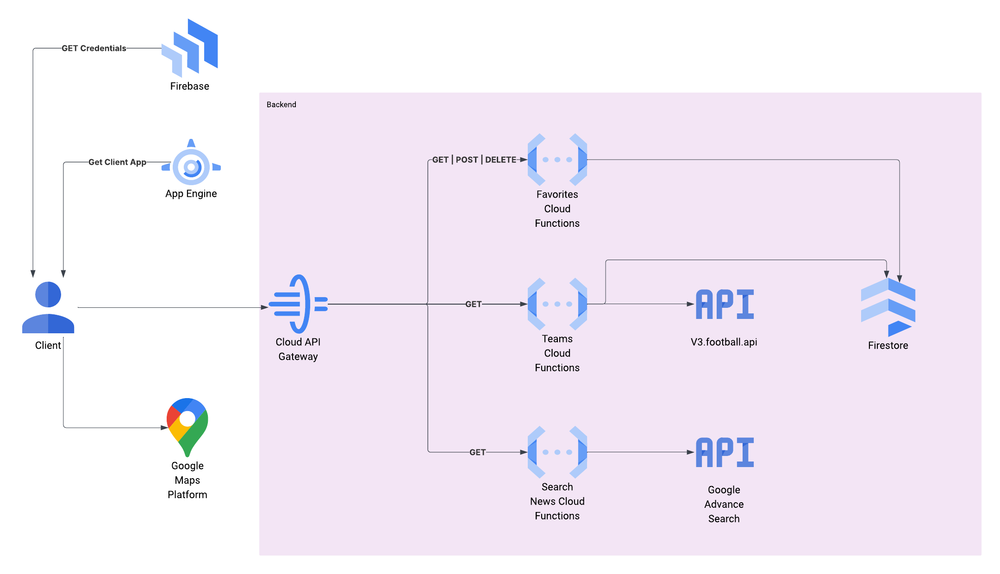
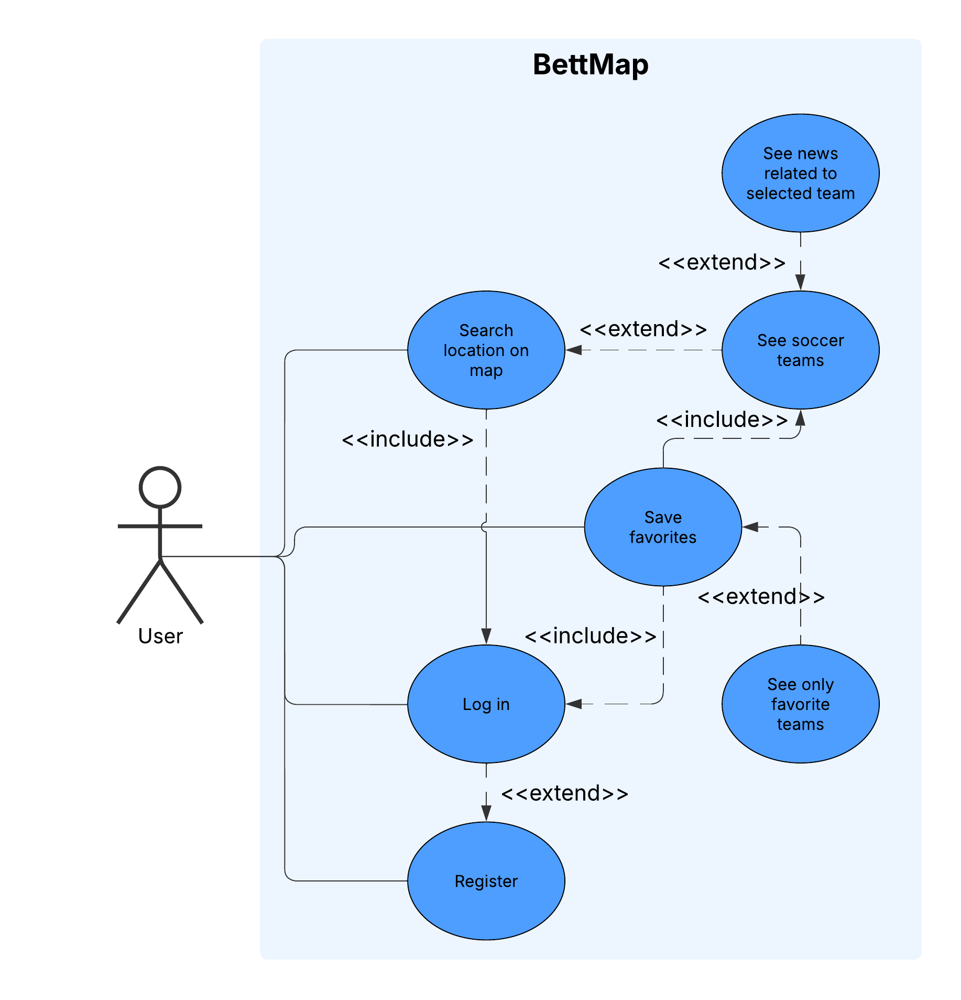

# BettMap – Vizualizare Globală a Pariurilor în Timp Real

## 1. Studiu de Caz – Context Național și Internațional

În România nu există o platformă care să afișeze pariurile live într-un mod vizual și interactiv. BettMap vine să acopere acest gol, folosind date în timp real de la Football API pentru a afișa pe hartă meciuri și echipe active, în funcție de locație. Utilizatorii pot explora evenimente sportive la nivel global, filtra pe orașe și interacționa cu alte persoane direct din aplicație.

## 2. Soluții Existente – Arhitectură, Tehnologii, Marketing

| Platformă     | Arhitectură            | Tehnologii principale | Strategii de marketing          |
|---------------|------------------------|------------------------|---------------------------------|
  |
| Google Maps   | Client-Server          | Maps API, JS           | Open APIs, Integrare în aplicații |
| FootBall Api        | Proprietară, scalabilă | NodeJs, React       | Sponsorizări, SEO, Reclame TV   |

Aceste soluții inspiră **BettMap** să combine date descentralizate cu o interfață modernă, map-based, oferind un mix între actualizare în timp real și interactivitate vizuală.

## 3. Tehnologii Propuse

| Tehnologie             | Rol                                           | Motivare                            |
|------------------------|-----------------------------------------------|--------------------------------------|
| React.js               | Frontend SPA                                  | Rapid, interactiv, component-based   |
| Google Maps JS API     | Hartă și pinuri live                          | Precizie, documentație solidă        |
| Firebase (Google Cloud)| Autentificare, Firestore, Cloud Functions     | Scalabilitate, integrare rapidă      |
| Swagger + OpenAPI      | Definirea și testarea API-urilor              | Standard industrial, compatibilitate |
| Node.js + Express      | Backend REST                                   | Rapid development, middleware power  |
|

## 4. Business Canvas

| Element         | Descriere                                                                 |
|-----------------|--------------------------------------------------------------------------|
| Problemă        | Lipsa unei vizualizări globale interactive pentru pariuri în timp real. |
| Soluție         | Mapă globală cu pinuri live pentru pariuri, filtrabilă pe regiuni/țări.  |
| Segmente        | Fani sport, utilizatori Polymarket, pariori casual.                     |
| Canale          | Web app, Google Ads, Reddit, Discord.                                   |
| Venituri        | Comisioane micro pe top-up-uri, reclame targetate.                      |
| Costuri         | Cloud, APIs, dezvoltare software.                                       |
| Avantaj         | UX modern, map-based, integrare betting live + comunitate               |
| Activități      | Colectare date, dezvoltare API, marketing                               |
| Parteneri       | Google Cloud, Polymarket, Discord communities                           |

## 5. Arhitectură Soluție
```
[User - React App]
     |
     |---> Login/Register (Firebase Auth)
     |---> Vizualizare hartă + Teams bets (Maps JS API)
     |---> Favorite / Search / Teams (Firestore + Functions)

[Lambda - NodeJs]
```



- Frontend comunică cu backend prin API REST folosind API Gateway pentru autentificare.
- Backend se ocupă de logica de cont, plasare/salvare favorite, caching date echipe si search.
- Google Maps API generează vizualizarea pinurilor si face cluster cu echipe din acelasi loc.
- Firebase gestionează utilizatorii.
- Firestore e folosit ca si DB pentru caching.

## 6. Use-Case Diagram



- Actor principal: utilizator
- Funcționalități secundare: socializare, preferințe, monetizare

## 7. API-uri și Fluxuri (OpenAPI / SwaggerHub)

[View OpenAPI Spec](./openapi.yaml)
